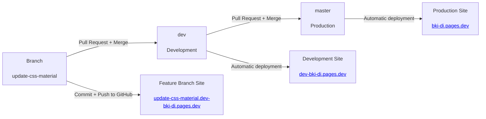
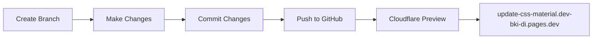
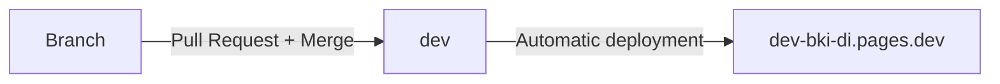
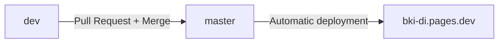
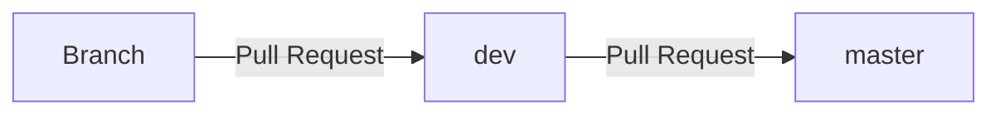

# Deployment Guide

This repository uses **GitHub + Cloudflare Pages** to automatically build and deploy the MkDocs learning sites.

Deployment is controlled by Git branches:

| Branch         | Environment       | URL                                       |
| -------------- | ----------------- | ----------------------------------------- |
| `master`       | Production        | https://bki-di.pages.dev                  |
| `dev`          | Development       | https://dev-bki-di.pages.dev              |
| Other branches | Temporary preview | `https://BRANCHNAME.dev-bki-di.pages.dev` |

The repository contains multiple MkDocs sites, but the deployment process is the same for the repository as a whole.

---

## General workflow



The normal process is:

1. Create a branch from `dev`.
2. Make and test your changes locally.
3. Commit and push the branch to GitHub.
4. Cloudflare automatically creates or updates the branch preview.
5. Test the preview and create a Pull Request into `dev`.
6. Merge the Pull Request to update the shared development site.
7. When ready for release, create a Pull Request from `dev` to `master`.
8. Merge the Pull Request to update production.

> [!IMPORTANT]
> **Creating a branch locally does not create a Cloudflare preview.** The branch must be **committed and pushed to GitHub** before Cloudflare can build the preview.

> [!IMPORTANT]
> `dev` and `master` are protected branches. Changes must go through **Pull Requests** rather than being pushed directly.

> [!NOTE]
> Cloudflare deployments can take **up to 10 minutes** to appear. This applies to creating a new branch preview, updating an existing preview, and deploying changes to `dev` or `master`. The exact time depends on what other deployment jobs are already running.

---

## Branch naming

Give branches **meaningful names that describe the work being done**.

For example:

```text id="kpadsj"
update-css-material
fix-assessment-links
new-networking-content
add-python-resources
```

The branch name is also used to create the Cloudflare preview URL.

For example:

```text id="1u3vcp"
update-css-material
        ↓
https://update-css-material.dev-bki-di.pages.dev
```

> [!TIP]
> Use a short, descriptive branch name. Because the branch name becomes part of the preview URL, meaningful names make it easier to identify what a preview contains.

---

## Branch previews

Every non-`dev`/`master` branch can have its own temporary Cloudflare preview.

The preview is created when the branch is pushed to GitHub.



For example:

```text id="0rxt9o"
Branch:
update-css-material

Preview:
https://update-css-material.dev-bki-di.pages.dev
```

The preview allows changes to be checked on the deployed MkDocs site before they are merged into `dev`.

> [!IMPORTANT]
> **Local changes that have not been committed and pushed to GitHub will not appear on the preview site.**

### Updating the preview

If additional changes are made after the initial push, they must also be **committed and pushed to GitHub** before Cloudflare can deploy them.

The same branch preview is updated with the latest pushed changes.

> [!NOTE]
> Allow up to **10 minutes** for Cloudflare to create or update a preview. Deployment time can vary depending on other jobs already running.

> [!NOTE]
> The branch preview is separate from the shared development site. Pushing a branch does not update `dev-bki-di.pages.dev`.

---

## Development environment

The `dev` branch is the **shared development version**.

**URL:** https://dev-bki-di.pages.dev

When a Pull Request from a branch is merged into `dev`, Cloudflare automatically deploys the updated development site.



The branch preview and development site are different:

| Site                   | Shows                    |
| ---------------------- | ------------------------ |
| Branch preview         | Your individual branch   |
| `dev-bki-di.pages.dev` | The current `dev` branch |

> [!NOTE]
> Changes only appear on the shared development site **after the Pull Request has been merged into `dev`**.

> [!NOTE]
> After merging into `dev`, allow up to **10 minutes** for Cloudflare to deploy the changes. The deployment may take longer if other jobs are already running.

---

## Production environment

The `master` branch is the **production version** of the learning material.

**URL:** https://bki-di.pages.dev

Production is updated by merging `dev` into `master` through a Pull Request.



> [!IMPORTANT]
> `master` is protected. Production changes must come through a Pull Request from `dev`.

> [!NOTE]
> After merging into `master`, allow up to **10 minutes** for Cloudflare to deploy the changes to production.

---

## Pull Requests

Pull Requests are used to promote changes between environments.



### Branch → `dev`

When the work is ready, create a Pull Request from your branch into `dev`.

After it is merged:

```text id="xoya4c"
Branch
  ↓
 dev
  ↓
dev-bki-di.pages.dev
```

### `dev` → `master`

When the changes in `dev` are ready for production, create a Pull Request from `dev` into `master`.

After it is merged:

```text id="c3tnjp"
 dev
  ↓
master
  ↓
bki-di.pages.dev
```

---

## Example Flow

Suppose you need to update the CSS learning material.

### 1. Create a branch from `dev`

Create a new branch based on the current `dev` branch and give it a meaningful name, such as:

```text id="bwdf3w"
update-css-material
```

### 2. Make and test your changes

Work on the MkDocs content locally and test the changes as required.

### 3. Commit and push the branch

The changes need to be **committed and pushed to GitHub**.

Once the branch is available on GitHub, Cloudflare can create its preview deployment.

### 4. Test the branch preview

The preview will be available at:

https://update-css-material.dev-bki-di.pages.dev

Check the deployed site before creating the Pull Request.

> [!NOTE]
> The preview may take **up to 10 minutes** to become available after the branch is pushed.

### 5. Create a Pull Request

Create a Pull Request:

```text id="af9don"
update-css-material → dev
```

After the Pull Request is reviewed and merged, Cloudflare deploys the updated development site:

https://dev-bki-di.pages.dev

> [!NOTE]
> Allow up to **10 minutes** for the updated development site to become available after the merge.

### 6. Release to production

When the changes in `dev` are ready for production, create a Pull Request:

```text id="nqhyiq"
dev → master
```

After merging, Cloudflare deploys the production site:

https://bki-di.pages.dev

> [!NOTE]
> Allow up to **10 minutes** for the production deployment to complete.
