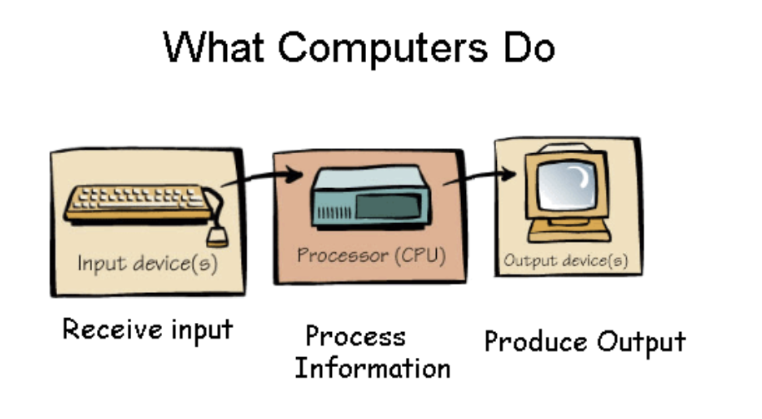

# Python Variables
## What is a Program?
A program is a set of instructions that a computer can execute to perform a specific task. In Python, a program is typically written in a text file with a .py extension. When you run the program, the Python interpreter reads the code and executes it line by line. Generally, a program requires input, processing, and output. The input is the data that the program will work with, the processing is the logic and calculations performed on that data, and the output is the result of the program's execution.



## Variables
In Python, variables are used to store data values. A variable is essentially a name that references a specific piece of data (like a number, string, or list). You can assign a value to a variable using the assignment operator =, and then use that variable later in your code. 

```py
#-------------Setup----------------

import Ed

Ed.EdisonVersion = Ed.V3

Ed.DistanceUnits = Ed.CM
Ed.Tempo = Ed.TEMPO_MEDIUM

#--------Your code below-----------

length = 10
Ed.Drive(Ed.FORWARD, Ed.SPEED_5, length)
```

In the above code: 

- Line 7 - Sets the distance type to cm 
- Line 12 - Sets a variable named distance to the value of `10`
- Line 13 - Moves the Edison forwards at `speed 5`, `10cm`

Notice in `line 13` that the Edison moves a distance of `10cm` because the length variable was created a set to 10 previously.

### Settings values to variables
Setting values to variables is a fundamental part of programming in Python. You use the assignment operator = to give a variable a value.  Recalling the value only requires you to use the name of the variable. 

You can set multiple variables and use them to set up other variables.

```py
#-------------Setup----------------

import Ed

Ed.EdisonVersion = Ed.V3

Ed.DistanceUnits = Ed.CM
Ed.Tempo = Ed.TEMPO_MEDIUM
#--------Your code below-----------

length_1 = 12
length_2 = 3
length_3 = length_1 + length_2
Ed.Drive(Ed.FORWARD, Ed.SPEED_5, length_3)
```

In the above we now have three variables. `length_1` and `length_2` are set to `10` and `5` respectively.  `length_3` is the sum of `length_1` and `length_2`. 

Based off `line 14`, how far will the Edison travel?

Variables can be called multiple times:

```py
import Ed

Ed.EdisonVersion = Ed.V3

Ed.DistanceUnits = Ed.CM
Ed.Tempo = Ed.TEMPO_MEDIUM
#--------Your code below-----------

length_1 = 12
length_2 = 3
length_3 = length_1 + length_2

Ed.Drive(Ed.FORWARD, Ed.SPEED_5, length_1)
Ed.TimeWait(length_2, Ed.TIME_SECONDS)
Ed.Drive(Ed.FORWARD, Ed.SPEED_5, length_2)
Ed.TimeWait(length_2, Ed.TIME_SECONDS)
Ed.Drive(Ed.FORWARD, Ed.SPEED_5, length_3)
```

This time the Edison moves three separate times.  Notice that we make the Edison wait in between each move.

How long is the Edison waiting after each move? 

We can make the Edison do a little dance:

```py

import Ed

Ed.EdisonVersion = Ed.V3

Ed.DistanceUnits = Ed.CM
Ed.Tempo = Ed.TEMPO_MEDIUM
#--------Your code below-----------

left_spin = 180
right_spin = 360
wait_time = 2
Ed.Drive(Ed.SPIN_LEFT, Ed.SPEED_5, left_spin)
Ed.TimeWait(wait_time, Ed.TIME_SECONDS)
Ed.Drive(Ed.SPIN_RIGHT, Ed.SPEED_5, right_spin)
Ed.TimeWait(wait_time, Ed.TIME_SECONDS)
Ed.Drive(Ed.SPIN_LEFT, Ed.SPEED_5, right_spin)
Ed.Ed.TimeWait(wait_time, Ed.TIME_SECONDS)
Ed.Drive(Ed.SPIN_RIGHT, Ed.SPEED_5, left_spin)
```

There are 2 things to note: 

We've changed the names of the three "length" variables to left_spin, right_spin and wait_time.  It's important and useful to name variables with names that are descriptive. 

Line 16 spins the Edison to the left but uses the right_spin variable.  The reverse is true of line 18.  Why does this work?  What will actually happen?

## Task Attempt
[Attempt Task 2 - Variables](../tasks/task-2-variables.md){ .md-button }
