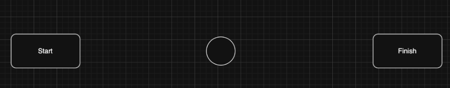

# Selection
For each of the tasks below, **copy** the code into **EdPy** and follow the instructions.

## Random Beeping
!!! abstract "Instructions"
    Fix the code below. The Edison should generate a random number and beep for the same amount of times as the random number.

??? example "Code - Click to expand"
    ```py
    #-------------Setup----------------

    import Ed

    Ed.EdisonVersion = Ed.V3
    Ed.DistanceUnits = Ed.CM
    Ed.Tempo = Ed.TEMPO_MEDIUM

    #--------Your code below-----------

    while True:
    num = Ed.Random(1, 3)
        
    if num == 1:
        Ed.PlayBeep()
        Ed.TimeWait(300, Ed.TIME_MILLISECONDS)
    elif num == 2:
        Ed.PlayBeep()
        Ed.TimeWait(300, Ed.TIME_MILLISECONDS)
        Ed.PlayBeep()
        Ed.TimeWait(300, Ed.TIME_MILLISECONDS)
    elif num == 3:
        Ed.PlayBeep()
        Ed.TimeWait(300, Ed.TIME_MILLISECONDS)
        Ed.PlayBeep()
        Ed.TimeWait(300, Ed.TIME_MILLISECONDS)
        Ed.PlayBeep()
        Ed.TimeWait(300, Ed.TIME_MILLISECONDS)
            
        Ed.TimeWait(1500, Ed.TIME_MILLISECONDS)
    ```

## Clap-on Clap-off
!!! abstract "Instructions"
    The code below should turn a light on upon a clap, if the lights are off. It should also turn them off on a clap, it the lights are on.

??? example "Code - Click to expand"
    ```py
    #-------------Setup----------------

    import Ed

    Ed.EdisonVersion = Ed.V3

    Ed.DistanceUnits = Ed.CM
    Ed.Tempo = Ed.TEMPO_MEDIUM

    #--------Your code below-----------
    leds_on = False

    while True:
    if Ed.ReadClapSensor() == Ed.CLAP_DETECTED:
        if leds_on == False:
            Ed.LeftLed(Ed.ON)
            Ed.RightLed(Ed.ON)
            leds_on = True
    else:
        Ed.LeftLed(Ed.OFF)
        Ed.RightLed(Ed.OFF)
        leds_on = False
                
    Ed.TimeWait(100, Ed.TIME_MILLISECONDS)
    ```

## Light Detection
!!! abstract "Instructions"
    Start the Edison driving forward until it drives under a table or similar type of area where the light is less than where it started. When it reaches a dark area, make it go backwards into the light.

## Obstacle Avoidance
!!! abstract "Instructions"
    Have the Edison drive from Point A (Start) to Point B (Finish) with an obstacle in between the points. After completing, add two more obstacles and have the Edison avoid them.

    { width=50% }

## Obstacle Detection
!!! abstract "Instructions"
    Complete the following steps one at a time, make sure to test your Edison after each step.

    **Step 1 – Basic movement**

    - Program Edison to drive forward.
    -   When it detects an obstacle, it should stop.

    **Step 2 – Avoid the obstacle**

    Modify the program so that when an obstacle is detected:

    - Edison moves backwards 10 cm
    - Turns left
    - Then continues driving forward.
    - Repeat for each obstacle Edison detects.

    **Step 3 – Add a visual signal**

    When Edison detects an obstacle:

    - Turn on the LEDs for 1 second
    - Then perform the same actions as before (reverse, turn, continue driving).

    **Step 4 – Make the robot smarter**

    Instead of always turning left:

    - Edison should randomly turn left or right after reversing.
    - Then continue driving until another obstacle is detected.